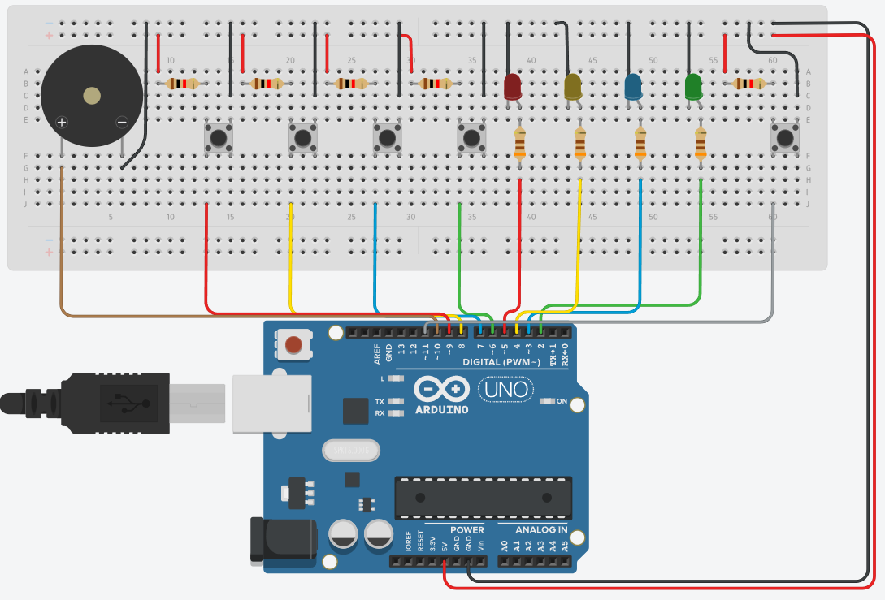

# Jogo-da-Memoria-Arduino
Projeto simples de sistemas embarcados, desenvolvido no Tinkercad, que simula o funcionamento do clássico jogo de memória “Genius” utilizando Arduino, LEDs, botões e busina.

## Descrição
Projeto simples que reproduz a lógica do clássico jogo **Genius** usando **Arduino UNO**, 4 LEDs, 4 botões e um buzzer. O Arduino gera uma sequência aleatória de LEDs que o jogador precisa repetir. A cada rodada a sequência aumenta, e o jogo termina quando o jogador erra a sequência.

Este projeto nasceu como prática da disciplina de **Sistemas Embarcados** e mostra como com poucos componentes é possível recriar um brinquedo relativamente caro.

---
## Componentes usados
- Arduino Uno
- 4 LEDs (cores opcionais)
- 4 resistores 220Ω para LEDs
- 4 botões táteis (push-buttons)
- 4 resistores de pull-down (ou usar `INPUT_PULLUP` no código)
- Buzzer piezo
- Jumpers e protoboard

---

## Como funciona (resumo)
1. Ao pressionar o botão de início (`botini`), o Arduino começa o jogo.
2. Gera-se um novo número aleatório (um dos 4 LEDs) e armazena-se na sequência.
3. O Arduino reproduz a sequência piscando os LEDs com som.
4. O jogador repete a sequência pressionando os botões correspondentes.
5. Se o jogador acertar toda a sequência, o jogo adiciona mais um passo (aumenta a dificuldade). Se errar, toca uma melodia de derrota e reinicia.

---
## Código 

